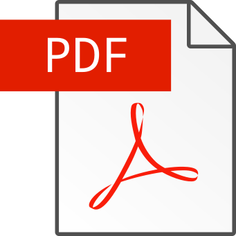

Ceci est ma thèse en LaTeX utilisant le template fourni par Jean Hare (version 2017).

Pour lire la version actuelle, c'est ici :

[](https://raw.githubusercontent.com/Hugo-Trentesaux/these_latex/master/split/these_light.pdf)


## Installation

### ArchLinux

```
pacman -S texlive-core texlive-fontsextra
```

et pour la gesiton des paquets, installer `tllocalmgr` ou réparer tlmgr

### Debian

```
apt install texlive-base texlive-fonts-extra xzdec 
```

ou préférer un installation manuelle, plus à jour [https://www.tug.org/texlive/acquire-netinstall.html](https://www.tug.org/texlive/acquire-netinstall.html)

### Dépendances

```
tlmgr install bbm was datetime fmtcount slantsc titlesec blindtext changebar versions adjustbox xstring csquotes listings
 xcolor mathtools eso-pic collectbox babel-french lm wrapfig
texhash
```

### IDE

Plugin [Latex Workshop](https://marketplace.visualstudio.com/items?itemName=James-Yu.latex-workshop) sur vscode(ium)

```
ext install latex-workshop # after Ctrl+P
```

### Script

Dépendance optionelle `pdftk` pour le script `compresspdf`.

```
snap install pdftk # Ubuntu
```

## Bibliographie

Échapper les `%` en les remplaçant par des `\%`. (mais laisser les `\%` existants tels quels)

